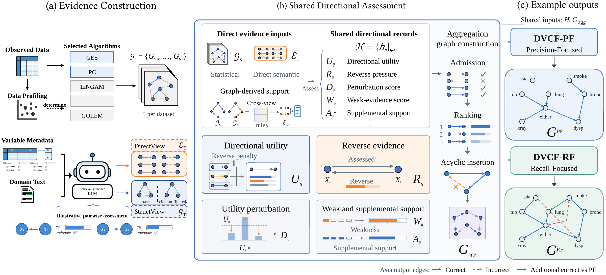
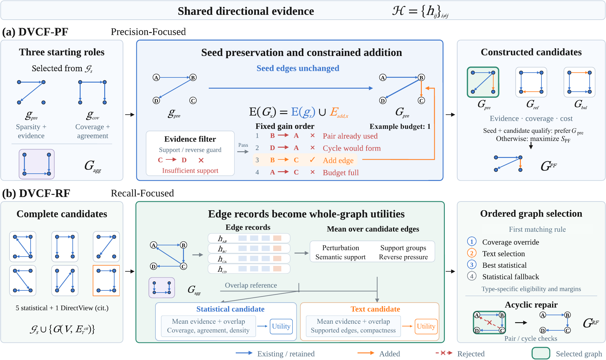
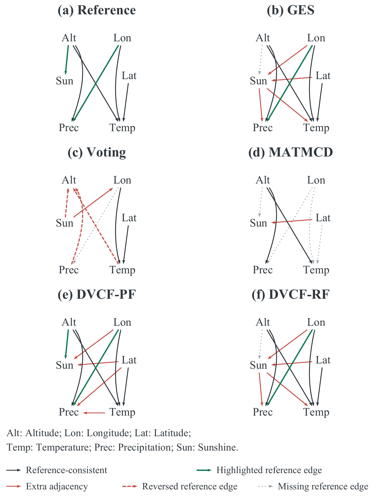

# DVCF: Beyond Edge Aggregation

**Dual-View Evidence Fusion for Causal Graph Discovery**

**Hang Zhou · Quan Qian** · Shanghai University

Official repository for **Beyond Edge Aggregation: Dual-View Evidence Fusion for Causal Graph Discovery**.

[About](#about) · [Key Features](#key-features) · [Quick Start](#quick-start) · [Evidence Construction](#evidence-construction) · [Datasets](#datasets) · [Evaluation](#evaluation) · [Repository Structure](#repository-structure)

## About

Statistical discoverers and semantic knowledge provide complementary evidence for causal graph discovery, but they can disagree about individual directions and complete structures. **Dual-View Causal Fusion (DVCF)** builds shared directional assessments from statistical graphs and two separately prepared semantic products, **DirectView** and **StructView**. These assessments support two graph decision procedures:

- **DVCF-PF (Precision-Focused):** preserve qualified seed edges, admit bounded additions, and compare the constructed candidates.
- **DVCF-RF (Recall-Focused):** compare complete statistical and text-derived candidates through ordered selection, then apply acyclic repair.

PF and RF produce **separate outputs**. They expose different precision–coverage tradeoffs through the structures available to each procedure.

[](assets/images/dvcf-framework.png)

*Framework overview from the manuscript. Statistical graphs and the two semantic products feed shared directional records and graph decisions. The algorithm labels and graphs in the first two panels are schematic; the final panel shows the Asia outputs, with edge colors indicating agreement with the reference graph.*

### Key Features

- **Statistical and semantic evidence fusion.** Combine graph estimates from multiple statistical discoverers with retrieval-grounded directional judgments.
- **Two complementary semantic products.** DirectView supplies directional scores and base/citation-filtered edge sets; StructView supplies separately constructed base/citation-filtered graphs for structural comparison.
- **Shared directional assessment.** Retain support, reverse-direction pressure, and source memberships for candidate construction and comparison.
- **Two candidate decision procedures.** PF supports seed-preserving augmentation; RF preserves complete source proposals through graph-level selection before repair.
- **Modular core implementation.** Reuse the fusion API, statistical adapters, and semantic preparation modules with caller-supplied data, models, and configuration.
- **Five benchmark datasets.** Access the statistical data, evaluation reference graphs, and metadata for all 50 variables across Auto_MPG, DWD_climate, Sachs, Asia, and Child.

<details>
<summary><strong>How PF and RF make graph decisions</strong></summary>

[](assets/images/dvcf-candidate-decisions.png)

*Candidate decision schematic from the Supplementary material. PF compares seed-preserving candidates using evidence, coverage, and addition costs. RF applies ordered eligibility and preference rules to complete proposals, followed by pair/cycle checks. The four-node graphs and unit addition budget are illustrative.*

</details>

## Quick Start

The release contains **28 core Python files** covering fusion, statistical graph generation, and semantic evidence preparation. Paths, model connections, prompts, portfolios, and experiment settings are supplied by the caller. The examples below introduce these interfaces; this release does not include an end-to-end benchmark runner.

### 1. Clone and set up an environment

Python 3.10 or newer is recommended. Create a virtual environment:

```bash
git clone https://github.com/ikaqiu-Lemon/DVCF.git
cd DVCF
python3 -m venv .venv
source .venv/bin/activate
```

On Windows, activate with `.venv\Scripts\activate`. Run the examples from the repository root so that Python can import `dvcf`.

The fusion core and the minimal example below use only the Python standard library. Install optional dependencies for the components you plan to call:

| Component | Packages |
|---|---|
| Statistical interfaces and data profiling | `numpy` |
| PC, FCI, GES, BDeu-GES, DirectLiNGAM | `numpy causal-learn` |
| Bootstrap RECI | `numpy causal-learn scikit-learn` |
| Hill climbing, BDeu tabu search, MMHC | `numpy pandas pgmpy` |
| DAG-GNN, GAE, GOLEM | `numpy gcastle torch` |
| DAGMA | `numpy dagma` |
| BM25 retrieval | `bm25s` |
| Recursive character splitting helper | `langchain-text-splitters` |
| Fuzzy relation matching helper | `fuzzywuzzy` |

For example, to use the causal-learn adapters:

```bash
python -m pip install numpy causal-learn
```

Embedding, reranking, and language-model clients are connected through caller-supplied callbacks. Install the corresponding provider libraries for your implementation. Adapter compatibility depends on the selected backend version and configuration.

### 2. Run a minimal cross-view example

This example computes structural support from two statistical graphs and a StructView. **The values are illustrative tutorial settings, not the manuscript's benchmark configuration.** No dataset download or model service is needed.

```python
from dvcf import StatisticalGraph, StructuralView, build_cross_view_evidence

variables = ("X", "Y", "Z")
sources = [
    StatisticalGraph("source_a", "constraint_based", frozenset({("X", "Y"), ("Y", "Z")})),
    StatisticalGraph("source_b", "score_based", frozenset({("X", "Y"), ("X", "Z")})),
]
structure = StructuralView(
    base_graph=frozenset({("X", "Y"), ("Y", "Z")}),
    citation_graph=frozenset({("X", "Y")}),
)
parameters = {"cross_view": {
    "text_profile_weights": (0.5, 1.0),
    "conflict_text_min": 1, "conflict_data_max": 1, "conflict_margin_max": 1,
    "pair_support_min": 1, "high_data_min": 2, "high_data_with_text_min": 1,
    "high_family_min": 2, "addition_data_with_text_min": 1,
    "addition_data_min": 2, "addition_family_min": 2,
    "anchor_density_target": 0.5,
    "reliability_weights": (1, 1, 1, 1, 1),
    "anchor_weights": (1, 1, 1, 1, 1),
    "majority_weights": (1, 1, 1, 1),
    "preservation_weights": (1, 1, 1, 1, 1, 1),
    "channel_budget_ratios": (0.5, 0.5, 0.5, 0.5),
}}
support = build_cross_view_evidence(variables, sources, structure, parameters)
for edge in [("X", "Y"), ("Y", "X")]:
    print(edge, support[edge])
```

Expected output:

```text
('X', 'Y') {'selected_count': 8.0, 'rule_count': 32.0, 'direction_support': 8.0}
('Y', 'X') {'selected_count': 0.0, 'rule_count': 0.0, 'direction_support': 0.0}
```

### 3. Prepare your configuration and call PF/RF

[`placeholder_parameters()`](dvcf/parameters.py) returns the four required parameter groups: `cross_view`, `directional`, `pf`, and `rf`. Replace every `<Please input your ...>` value with the numeric scalar or vector required at its point of use. Placeholders intentionally raise an error instead of silently applying experiment defaults.

```python
from dvcf import placeholder_parameters

parameters = placeholder_parameters()
for group, fields in parameters.items():
    print(group, sorted(fields))
```

Once the parameter groups and evidence inputs are filled, the fusion sequence is:

```python
from dvcf import (
    build_cross_view_evidence, assess_directional_evidence, select_pf, select_rf,
)

def fuse_graphs(variables, sources, direct_view, struct_view, sample_count, parameters):
    support = build_cross_view_evidence(variables, sources, struct_view, parameters)
    assessment = assess_directional_evidence(
        variables, sources, direct_view, support, parameters,
    )
    pf_edges = select_pf(variables, sources, assessment, parameters)
    rf_edges = select_rf(
        variables, sources, direct_view, assessment, sample_count, parameters,
    )
    return pf_edges, rf_edges
```

`pf_edges` and `rf_edges` are `frozenset` objects containing `(source, target)` directed-edge tuples. The function above requires your prepared inputs; it does not generate evidence or fill the configuration automatically.

| Input | Meaning |
|---|---|
| `variables` | Unique variable names in the observation-column order. |
| `sources` | `StatisticalGraph` objects with source IDs, algorithm-family IDs, and directed edges. |
| `direct_view` | A `DirectionalView` with ordered-pair scores and base/citation-filtered memberships. |
| `struct_view` | A `StructuralView` with its own base and citation-filtered graphs. |
| `sample_count` | Number of observational samples, used by RF candidate scoring. |
| `parameters` | Explicit numeric configuration for the four fusion parameter groups. |

## Evidence Construction

### Statistical graphs

[`discover_statistical_graphs`](dvcf/statistical/model.py) accepts an in-memory observation matrix, ordered variable names, data-profile rules, a `SourceSpec` portfolio for each profile, per-source algorithm parameters, and a seed. It returns the `StatisticalGraph` list consumed by fusion.

The adapter registry supports PC, FCI, GES, BDeu-GES, DirectLiNGAM, hill climbing, BDeu tabu search, MMHC, DAG-GNN, GAE, GOLEM, DAGMA, and bootstrap RECI. The caller chooses the portfolio; the registry is not a preset ensemble. Inspect [`profile.py`](dvcf/statistical/profile.py) for profile-rule inputs and each adapter for its required keyword arguments.

### DirectView and StructView

The semantic modules expose the following preparation sequence:

1. **Prepare documents and metadata.** Use [`Document`, `Chunk`, and `split_documents`](dvcf/semantic/corpus.py) to build passage records. [`VariableMetadata` and `metadata_queries`](dvcf/semantic/retrieval.py) construct variable and variable-pair queries.
2. **Retrieve contextual evidence.** [`HybridRetriever`](dvcf/semantic/retrieval.py) combines dense and BM25 rankings through reciprocal-rank fusion and reranking. Supply embedding, sparse-search, reranking, and query-expansion callbacks. `BM25Retriever` provides the sparse-search adapter; use `lambda query: (query,)` to disable query expansion.
3. **Summarize and assess directions.** [`summarize_evidence`](dvcf/semantic/summary.py) prepares domain summaries; [`enhance_relation_context`](dvcf/semantic/relation_context.py) augments relation context; [`judge_pairs`](dvcf/semantic/judgments.py) obtains pairwise judgments using your prompt builder and [`ModelClient`](dvcf/semantic/model_client.py) transport.
4. **Construct the two products.** [`prepare_views`](dvcf/semantic/views.py) requires separate `direct_judgments` and `structural_judgments`, graph parameters, and citation policies. It returns a `DirectionalView` and a `StructuralView`.

Use `GraphParameters` to specify edge budgets, score thresholds, and degree limits. Citation filtering checks whether the cited labels resolve to the supplied context; it does not establish that a passage proves a causal direction. Provide normalized numeric directional scores in `[0, 1]`.

The manuscript uses BM25 and BGE-M3 retrieval with BGE reranking. The released interfaces allow these components to be connected through callbacks; model weights, semantic corpora, prompts, and provider credentials are supplied separately. Keep reference graphs for evaluation, outside the evidence-generation and fusion inputs.

## Datasets

The five statistical benchmarks and metadata for all **50 variables** are available in [`data/`](data/). The packaged versions used in the manuscript are:

| Dataset | Samples | Variables | Reference edges | Type |
|---|---:|---:|---:|---|
| [Auto_MPG](data/Auto_MPG/) | 392 | 5 | 5 | Continuous |
| [DWD_climate](data/DWD_climate/) | 349 | 6 | 6 | Continuous |
| [Sachs](data/Sachs/) | 7,466 | 11 | 19 | Continuous |
| [Asia](data/asia/) | 1,000 | 8 | 8 | Discrete |
| [Child](data/child/) | 1,000 | 20 | 25 | Discrete |

### Sources and file formats

We follow the public benchmark sources listed in [MATMCD](https://github.com/D2I-Group/matmcd): [UCI Auto MPG](https://archive.ics.uci.edu/dataset/9/auto+mpg), [Tübingen Cause-Effect Pairs](https://webdav.tuebingen.mpg.de/cause-effect/), and the bnlearn [Sachs](https://www.bnlearn.com/bnrepository/discrete-small.html#sachs), [Asia](https://www.bnlearn.com/bnrepository/discrete-small.html#asia), and [Child](https://www.bnlearn.com/bnrepository/discrete-medium.html#child) pages. Auto_MPG, DWD_climate, and Sachs use the processed data and reference graphs from the [Takayama release](https://github.com/mas-takayama/LLM-and-SCD). In particular, Sachs uses its 19-edge evaluation reference. Asia and Child use fixed 1,000-row samples from their Bayesian networks.

Each dataset folder contains:

| File | Contents |
|---|---|
| `<dataset>_data.csv` | Observational data: variable names in the first row, one sample per subsequent row. |
| `<dataset>_GTmatrix.csv` | Evaluation reference adjacency matrix, without header or index. |
| `reference_edges.csv` | The same reference as a labeled `source,target` edge list. |
| `metadata.json` | Variable names, full names, descriptions, and synonyms in column order. |
| `manifest.json` | Paths, dimensions, column order, source links, and original-file checksums. |
| `variable_statistics.csv` | Observed ranges, missing counts, distinct values, and observed discrete codes. |

For reference matrices, `A[i,j] = 1` denotes `i → j`, and both axes follow the data-column order. `column_index_1based` starts at 1. Discrete numeric codes are categorical labels. Metadata describes variables; no extra numeric-code-to-category mapping is inferred.

See [`datasets.csv`](datasets.csv), [`DATA_SOURCES.md`](DATA_SOURCES.md), and [`checksums.sha256`](checksums.sha256) for the index, provenance, and integrity checks. The release preserves the packaged data and reference files. Semantic retrieval corpora, experiment configurations, execution logs, and model outputs are not included.

## Evaluation

The manuscript evaluates directed Precision, Recall, F1, and structural Hamming distance (SHD) on five benchmarks. An edge reversal contributes one false positive and one false negative to the directed metrics; SHD assigns unit cost to an addition, deletion, or reversal.

### Main comparison

Each cell reports **F1 ↑ / SHD ↓**. Bold marks the best value for each metric and dataset, including ties. These are the manuscript's reported results; the tutorial example above is a separate interface demonstration.

| Method | Auto_MPG | DWD_climate | Sachs | Asia | Child |
|---|---|---|---|---|---|
| GES | 0.400 / 5 | 0.667 / 5 | 0.182 / 24 | 0.769 / 3 | 0.485 / 17 |
| Voting | 0.000 / 8 | 0.333 / 8 | 0.108 / 33 | 0.533 / 7 | 0.348 / 30 |
| MATMCD | 0.667 / **3** | 0.444 / 5 | 0.706 / **10** | 0.857 / **2** | 0.766 / 10 |
| MATMCD-RE | 0.667 / **3** | 0.444 / 5 | 0.667 / 11 | 0.857 / **2** | **0.800** / **8** |
| **DVCF-PF** | 0.667 / 4 | **0.750** / **4** | **0.714** / 12 | 0.857 / **2** | 0.571 / 15 |
| **DVCF-RF** | **0.769** / **3** | 0.667 / 5 | 0.452 / 16 | **0.889** / **2** | 0.727 / 9 |

The separately evaluated DVCF variants collectively attain the highest F1 on **four of five** benchmarks: PF on DWD_climate and Sachs, and RF on Auto_MPG and Asia. Both exceed the evaluated Voting baseline in F1 on all five. MATMCD-RE remains best on Child. The comparisons retain each method's semantic input configuration; MATMCD-RE extends MATMCD's Top-K Guess from one to two confidence-ranked answers per relation.

### Structural example: DWD_climate

<p align="center">
  <a href="assets/images/dwd-climate-comparison.png"></a>
</p>

*Manuscript Figure 2. Shared node positions make the recovered structures comparable. PF recovers all six reference directions, including Alt → Sun, with four extra adjacencies. RF selects GES, which omits Alt → Sun and includes four extra adjacencies.*

PF is useful when preserving a qualified seed and controlling additions matches the desired structural priority. RF can help when a complete source proposal retains an edge combination that direct aggregation loses. Their names describe decision priorities; neither variant is guaranteed to dominate the other on every dataset or metric.

## Repository Structure

```text
DVCF/
├── dvcf/
│   ├── interfaces.py         # Typed graph and evidence inputs
│   ├── parameters.py         # Required fusion parameter schema
│   ├── graph_utils.py        # Graph operations and deterministic repair
│   ├── cross_view.py         # Statistical/StructView evidence aggregation
│   ├── directional.py        # Shared assessment and aggregation graph
│   ├── pf.py                 # Seed-preserving candidate construction
│   ├── rf.py                 # Whole-graph selection and acyclic repair
│   ├── statistical/          # Data profiling and statistical adapters
│   └── semantic/             # Retrieval, judgments, citation checks, views
├── data/                     # Five benchmarks and variable metadata
├── assets/images/            # Figures used in this README
├── DATA_SOURCES.md           # Dataset provenance and attribution
├── datasets.csv              # Dataset index
├── checksums.sha256          # Data-release integrity checks
└── README.md
```

The core functions operate on supplied in-memory inputs and return graphs or evidence records. File loading, experiment orchestration, and result export can be implemented around these interfaces for a specific application.

## Acknowledgments

We thank the authors of [MATMCD](https://github.com/D2I-Group/matmcd), the [Takayama release](https://github.com/mas-takayama/LLM-and-SCD), the statistical-discovery libraries, and the original dataset providers. Please credit the corresponding upstream sources when using their resources. Dataset and reference-graph terms are described in [`DATA_SOURCES.md`](DATA_SOURCES.md).
